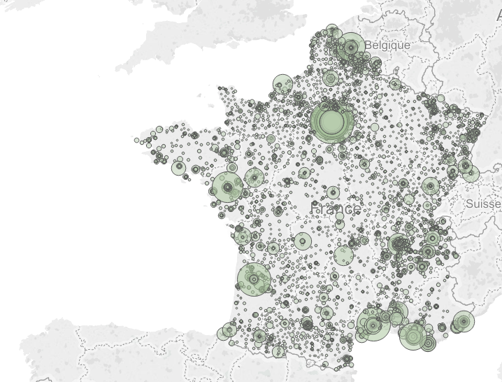

dataddict
=========

Business case : 9 hours only, Python and D3js (Scholar project, 2014)

## Objectif :
Déterminer les villes pour lesquelles la construction de logements serait pertinente pour des jeunes cadres dynamiques.

#### Qualité de vie :
* Loisirs (Insee, 2011) 

#### Dynamisme économique :
* Nb d’entreprises existantes (Insee, 2013)
* Nb d’entreprises crées en (Insee, 2013)
* Nb de start-up crées  (Insee, 2013)
* Nombre d’offres (crawler Indeed, 2014)
* Nombre de cadres par ville (Insee, 2013)

#### Immobilier :
* Ratio prix loyer / prix achat, en fonction d'une surface comprise entre 30 et 50m2 (crawler seloger.com, 2014)

#### Calcul avec pondération et début de visualisation avec Tableau.

